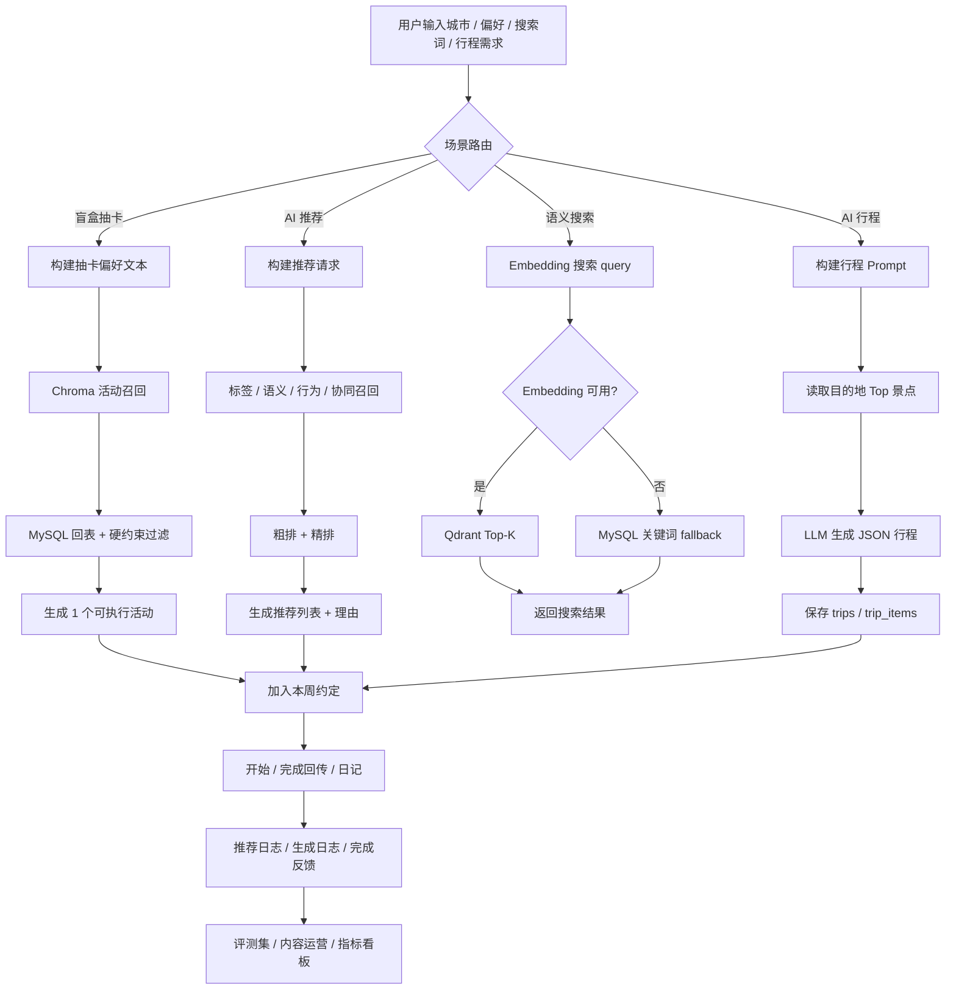

# 【PRD】懒得（děi）动 AI 出行决策 + 本周约定系统 - 知识库模板版

## 变更记录

| 版本 | 日期 | 变更内容 | 变更人 |
| --- | --- | --- | --- |
| v1.3-kb | 2026-07-08 | 按个人知识库中 PRD 模板重排：项目概述、技术选型、功能清单、内容资产构建、AI 决策流程、AI 评测、接口、风险、指标、验收、附录表格 | Codex |
| v1.3-ai-pm | 2026-07-08 | 按 AI 产品经理视角补充场景假设、AI 能力边界、数据闭环、评测指标、上线闸门、成本与 ROI | Codex |
| v1.3 | 2026-07-08 | 基于当前代码补齐邮箱验证码登录、AI 推荐、语义搜索、AI 行程、本周约定、日记评论、VIP 支付、API 契约与风险 | Codex |
| v1.2 | 2026-06-28 | 新增底部导航、登录/注册、我的页面 UI 与交互规格 | 项目原文档 |
| v1.1 | 2026-06-27 | 扩展 Web / iOS / Android；补充 MVP 边界与验收标准 | 项目原文档 |
| v1.0 | 2026-06-27 | 原始草稿，面向手机 Web | 项目原文档 |

## 事实核查与边界

本 PRD 按个人知识库中 `异地特色菜 RAG 介绍文案生成 + AI 评测系统` 的 PRD 结构调整，但内容以 `lazy2move` 当前代码、README、数据库迁移和测试为准。

| 核查项 | 旧描述 / 易误解点 | 当前项目事实 | 本 PRD 处理 |
| --- | --- | --- | --- |
| 账号登录 | V1.2 写手机号 + 短信验证码；README 局部仍写手机号 + 密码 | 当前 API 与前端是邮箱 + 6 位验证码：`POST /api/v1/auth/code`、`/auth/login`、`/auth/register` | 按邮箱验证码写已实现；手机号、微信、Apple 作为待确认 |
| 访客体验 | V1.2 写访客可正常使用主流程 | 当前 `AuthGate` 与 Tab Layout 会将未注册用户重定向到 `/login`，主业务页面要求注册态 | 写为当前限制，访客策略列为待决策 |
| 底部导航 | V1.2 写发现 / 今日 / 我的 | 当前 Tab 为：首页 / 本周约定 / 我的；`draw` Tab 文件存在但隐藏 | 按当前实现写，并保留命名调整建议 |
| 签到奖励 | README 写签到满 7 天 | 当前 `checkins.ts` 的奖励阈值是 5 天，奖励文案为“下周获得 1 个积分” | 按 5 天写，README 作为文档债 |
| AI 产品边界 | 容易包装成完整 Agent / RAG 平台 | 当前是 AI 出行决策 MVP：有向量召回、语义搜索、LLM 生成和规则兜底，但没有工具编排型 Agent、引用溯源型 RAG 知识库、评测 Harness 或知识治理后台 | 不夸大，按 AI PM 视角写能力、数据、评测、上线闸门与 ROI |
| 指标数字 | PRD 模板里常写召回率、SLA、准确率目标 | 当前项目未沉淀真实线上基线 | 指标作为目标口径和验收建议，不写成已达成结果 |

---

## 一、项目概述

### 1.1 背景

用户在周末或碎片时间想出门，但常见出行 App 给的是“更多地点、更多榜单、更多攻略”，并没有真正降低决策成本。对“懒得动”这类用户来说，核心痛点不是信息不足，而是：

- 不想在一堆选项里比较；
- 不确定某个地方是否适合自己的预算、时间、距离和情绪；
- 想要一个可信但不要太复杂的出门方案；
- 出门后希望沉淀记录，而不是只完成一次消费。

当前项目已经实现从“选择城市 / 偏好 -> 抽卡 -> 详情 -> 本周约定 -> 完成回传 -> 日记”的基础闭环，并扩展了 AI 推荐、语义搜索、AI 行程、向量召回、LLM 推荐理由、签到成长和 VIP 月卡能力。

### 1.2 项目目标

建立一套“AI 决策 -> 用户承诺 -> 出行完成 -> 内容反馈 -> 推荐优化”的出行决策闭环，用 AI 帮用户把开放式问题“去哪玩”收敛为一个可执行方案。

目标拆解：

1. **降低决策成本**：用户不用反复筛选地点，系统返回少量甚至单个结果。
2. **提高可执行性**：推荐结果必须包含预算、距离、时长、步骤、tips 或地图信息。
3. **形成行为闭环**：用户能将结果加入本周约定，并完成开始、回传和日记沉淀。
4. **沉淀数据资产**：活动卡、景点、标签、偏好、推荐日志、完成日记为后续评测和个性化提供基础。
5. **验证商业化**：通过 VIP 提升周约定额度和后续 AI 行程权益，验证付费意愿。

### 1.3 解决方案

以 **AI 出行决策 + 规则约束 + 行为闭环** 为主，LLM 生成为辅：

- 决策前：收集城市、人数、预算、心情、分类、距离、出发地等偏好。
- 决策中：使用 Chroma / Qdrant / MySQL 候选池、规则硬约束、排序权重和 LLM 推荐理由。
- 决策后：用户加入本周约定，按周额度管理计划。
- 完成后：通过完成回传、日记、评论、点赞、签到和成长体系沉淀反馈。
- 运营侧：后续通过内容完整率、评测集、AI 日志、推荐效果和成本看板持续优化。

### 1.4 北极星指标

**每周 AI 辅助完成出行次数**

```text
每周 AI 辅助完成出行次数 =
  当周完成回传的 todos 数
  且该 todo 来源于抽卡 / AI 推荐 / AI 行程中的至少一个 AI 决策链路
```

---

## 二、团队成员

当前代码仓库不能证明真实团队成员姓名，因此本节只给角色与职责建议。

| 角色 | 职责 |
| --- | --- |
| AI 产品经理 | 场景定义、PRD、指标体系、AI 评测口径、验收标准、上线策略 |
| 前端工程师 | Expo / React Native 多端页面、路由、状态管理、体验降级 |
| 后端工程师 | Express API、MySQL 模型、鉴权、支付、上传、业务状态机 |
| AI / 算法工程师 | 向量召回、Embedding、LLM 调用、排序策略、Prompt、评测集 |
| 内容运营 | 活动卡、目的地、景点、标签、封面、日记审核、内容质量 |
| 测试 / QA | API 测试、端到端流程、AI 降级、支付沙箱、兼容性验证 |

---

## 三、技术选型

| 组件 | 当前选型 | 说明 |
| --- | --- | --- |
| 多端框架 | Expo + React Native + React Native Web | Web、iOS、Android 同构开发 |
| 路由 | Expo Router | Tab + Stack 页面结构 |
| 状态管理 | React Context + AsyncStorage + Redux Toolkit | 账号、城市、偏好、抽卡、本地缓存 |
| UI 体系 | 自定义 theme + Ant Design RN | 浅紫蓝视觉、成长资产风格、移动端组件 |
| 后端框架 | Node.js + Express + TypeScript | API、鉴权、支付、上传、AI 路由 |
| 数据库 | MySQL | 用户、活动、抽卡、约定、日记、会员、AI 日志 |
| 基础抽卡候选 | MySQL activities | 无 AI 服务时可用 |
| 抽卡向量召回 | Chroma + activities collection | 当前用于活动卡语义召回，可降级 |
| 旅游推荐向量库 | Qdrant | 用于 destinations / attractions / users 向量检索 |
| Embedding Provider | OpenAI / 智谱 / 硅基流动 | 通过配置切换 |
| LLM Provider | OpenAI / 智谱 / DeepSeek / 硅基流动 | 推荐理由和 AI 行程 |
| 地图 | 高德地图 JS API + 导航 URI | Web 地图画布，未配置时降级 |
| 支付 | 支付宝 page pay | VIP 月卡沙箱/生产配置 |
| 邮件验证码 | mock / SMTP / QQ 邮箱 | 当前账号入口使用邮箱验证码 |
| 测试 | Node test + Expo lint + TypeScript compile | API 单测、前端 lint、构建验证 |

---

## 四、功能清单

| 功能点 | 内容 | 优先级 | 当前状态 |
| --- | --- | --- | --- |
| 邮箱验证码登录/注册 | 邮箱、6 位验证码、JWT、注册态恢复、guest 合并 | P0 | 已实现 |
| 城市与偏好选择 | 城市、人数、时长、预算、心情、随机程度、环境、半径、出发地 | P0 | 已实现 |
| 盲盒抽卡 | 约束匹配、最多 3 次结果、重抽、当前抽卡恢复 | P0 | 已实现 |
| 活动详情 | 活动介绍、步骤、tips、地址、地图/导航、加入约定 | P0 | 已实现 |
| 本周约定 | 自然周窗口、普通 1 条/VIP 3 条、开始/取消/完成 | P0 | 已实现 |
| 完成回传 | 感受文字、附件上传、visibility、review_status | P0 | 已实现 |
| 日记与互动 | 日记列表/详情、点赞、评论、回复、评论点赞 | P1 | 已实现基础能力 |
| 签到成长 | 周签到、5 天奖励、XP、等级称号、成长进度 | P1 | 已实现 |
| 头像与资料 | 昵称远端保存、头像上传/删除、媒体 URL 规范化 | P1 | 部分实现，头像接口需补鉴权 |
| AI 推荐 | 多路召回、粗排、精排、LLM 推荐理由、推荐日志 | P1 | 已实现基础链路 |
| 语义搜索 | Embedding 搜索目的地/景点，关键词 fallback | P1 | 已实现 |
| AI 行程 | SSE / 异步生成、JSON 行程、保存 trips / trip_items | P1 | 已实现基础链路 |
| AI 服务状态 | 返回 LLM、Embedding、Qdrant、Chroma 状态 | P1 | 已实现 |
| VIP 月卡 | 支付宝创建订单、查单、回调、会员额度 | P1 | 已实现沙箱/接口链路 |
| AI 质量评测后台 | Golden Set、人工标注、AI 输出抽检、成本看板 | P1 | 未实现 |
| 内容审核后台 | completion pending 审核、公开日记治理 | P1 | 未实现 |
| 推荐 A/B 实验 | 规则、向量、LLM 理由分层实验 | P2 | 未实现 |
| 行程编辑与拆解约定 | AI 行程保存后拆成本周约定 | P2 | 未实现 |
| Agent / RAG 化扩展 | 工具编排、引用溯源、知识版本治理、评测 Harness | P2 | 未实现，不应提前宣传 |

---

## 五、内容资产与知识库构建方案

当前项目不等同于完整 RAG 知识库，但已经具备用于 AI 推荐和出行决策的内容资产。这里按知识库 PRD 模板，把内容资产拆成可治理的数据域。

### 5.1 数据来源与收集

| # | 数据大类 | 当前来源 | 典型内容 | 到手格式 / 表 |
| --- | --- | --- | --- | --- |
| 1 | 活动卡 | `activities`、导入脚本、seed / migrations | 本地玩法、预算、时长、地址、步骤、tips、封面 | MySQL、SQL、脚本导入 |
| 2 | 城市 | `cities` | 上海、杭州等服务城市 | MySQL |
| 3 | 目的地 | `destinations` | 城市目的地、摘要、热度、评分 | MySQL |
| 4 | 景点 | `attractions` | 景点名称、价格、评分、适合人群、季节 | MySQL |
| 5 | 标签 | `travel_tags`、`mood_tags` | 心情、主题、场景、人群、季节 | JSON / MySQL |
| 6 | 用户偏好 | `preferences`、`user_profiles` | 预算、出行类型、偏好标签、人数、时长 | JSON / MySQL |
| 7 | 用户行为 | `draw_sessions`、`draw_results`、`todos` | 抽卡、重抽、加入约定、开始、完成 | MySQL |
| 8 | 完成反馈 | `todo_completion_submissions`、`diary_comments` | 日记、评论、点赞、公开意愿 | MySQL |
| 9 | AI 日志 | `recommendation_logs`、`ai_generation_logs` | 推荐参数、策略、分数、理由、生成任务 | MySQL |

数据收集原则：

- 先保障可执行字段：城市、地址、预算、时长、步骤、tips、封面、状态。
- 每条可推荐内容必须有稳定 ID，便于日志回放和评测。
- 标签应使用枚举或规范表，避免“安静”“安静感”“清静”这类不可控扩散。
- AI 结果不得脱离真实内容字段编造卖点。
- 完成日记和用户行为先作为评测与产品分析数据，不宣称已自动训练模型。

### 5.2 知识结构设计

| 知识库 / 数据域 | 内容范围 | 分块 / 建模策略 | 主要用途 | 当前状态 |
| --- | --- | --- | --- | --- |
| 活动卡知识库 | `activities` 的标题、摘要、描述、标签、步骤、tips、地址 | 每个 activity 作为一个 document，写入 Chroma；metadata 保留 city、category、budget、duration 等 | 抽卡语义召回 | 已实现 Chroma service 和同步脚本 |
| 目的地/景点知识库 | `destinations`、`attractions`、tags、价格、评分、适合人群 | 写入 Qdrant point，MySQL 保存 embedding_point_id | AI 推荐和语义搜索 | 已实现基础接口 |
| 用户偏好画像 | `user_profiles`、抽卡偏好、旅行偏好 | 偏好文本向量化，保存 user embedding | 个性化推荐 | 已有表与接口，闭环待完善 |
| 行为反馈库 | 抽卡、重抽、约定、完成、日记、点赞、评论 | 不直接向量化，先用于指标和推荐评估 | 推荐评测、转化分析 | 已有数据基础，埋点需补齐 |
| AI 评测集 | Golden Set、负例、边界样例、人工标注 | 按场景维护测试问题、期望结果、风险类型 | 上线闸门和回归测试 | 待建设 |

### 5.3 数据清洗与治理

| 层级 | 处理内容 | 当前建议 |
| --- | --- | --- |
| 格式清洗 | 标题、描述、步骤、tips、标签、封面 URL | 导入前清除空值、重复标签、无效封面 |
| 结构补全 | 预算、时长、地址、经纬度、城市、环境 | 缺失关键字段的内容不进入推荐池 |
| 坐标与距离 | 出发地和目的地距离 | 坐标缺失时不能展示 0 km；半径筛选下坐标缺失不可通过硬约束 |
| 标签规范 | 心情、分类、场景、人群、季节 | 建立枚举表，避免运营自由输入导致召回混乱 |
| 向量同步 | Chroma / Qdrant 入库 | 同步结果记录 count、失败原因、模型版本 |
| 人工抽检 | 高曝光活动、热门目的地、AI 推荐理由 | 建立抽样机制，先从 Top 活动开始 |

### 5.4 元数据标签设计

| 字段名 | 类型 | 是否必填 | 示例值 | 说明 |
| --- | --- | --- | --- | --- |
| `entity_type` | String | 是 | `activity` / `attraction` / `destination` | 内容类型 |
| `activity_id` | Number | activity 必填 | `42` | 回表查询活动详情 |
| `attraction_id` | Number | attraction 必填 | `8` | 回表查询景点详情 |
| `city_id` | Number | 是 | `1` | 城市过滤 |
| `city_name` | String | 是 | `上海` | 展示和核查 |
| `category` | String | 是 | `文艺` | 推荐过滤 |
| `mood` | String | 是 | `放松` | 偏好匹配 |
| `mood_tags` | Array | 建议 | `["放松","安静"]` | 语义增强 |
| `environment` | Enum | 是 | `indoor` | 室内/室外 |
| `budget_yuan` | Number | 是 | `80` | 预算约束 |
| `duration_minutes` | Number | 是 | `150` | 时长约束 |
| `district` | String | 建议 | `徐汇区` | 区域展示 |
| `source` | String | 是 | `blind_box_import` | 来源追踪 |
| `embedding_model` | String | 是 | `BAAI/bge-m3` | 模型版本 |
| `source_hash` | String | 是 | `sha256...` | 判断是否需要重建向量 |
| `is_active` | Boolean | 是 | `true` | 下架内容不得推荐 |

---

## 六、AI 出行决策流程



流程要求：

- 抽卡最终只返回 1 个方案，避免重新制造选择困难。
- 推荐列表必须展示匹配标签或推荐理由，不能只展示“AI 推荐”标签。
- AI 行程必须输出可解析 JSON；解析失败应提示重试或进入异步任务失败状态。
- 搜索必须返回 `mode: semantic` 或 `mode: keyword`，让产品能评估语义能力覆盖。
- 所有 AI 链路必须有降级策略，不因模型或向量库不可用阻塞 P0 主流程。

---

## 七、AI 评测方案

### 7.1 评测维度与权重

以下权重是上线前建议口径，必须通过真实样本校准，不能视为当前已达成结果。

| 维度 | 权重 | 评分标准（1-5 分） | 适用模块 |
| --- | --- | --- | --- |
| 约束合规性 | 30% | 是否满足城市、预算、时长、人数、距离、室内外等硬约束 | 抽卡、推荐、行程 |
| 推荐相关性 | 25% | 是否匹配用户心情、标签、搜索意图、旅行偏好 | 抽卡、推荐、搜索 |
| 可执行性 | 20% | 是否有地址、步骤、tips、预算、时长或可加入约定 | 抽卡、行程 |
| 理由真实性 | 15% | 推荐理由是否基于真实字段，是否避免幻觉和过度承诺 | 推荐理由、行程 |
| 体验与成本 | 10% | 响应是否稳定，延迟和成本是否可接受 | 全部 AI 链路 |

加权综合分 = `各维度得分 * 权重` 之和。

触发规则建议：

| 综合分 | 处理 |
| --- | --- |
| `< 3.0` | 不建议上线，进入人工复核或策略调整 |
| `3.0 - 3.8` | 可灰度，需重点观察负反馈和转化 |
| `>= 3.8` | 可进入常规发布候选，但仍需线上监控 |

### 7.2 LLM-as-Judge Prompt 框架

> 当前项目尚未实现评测 Harness。本 Prompt 是后续 AI 评测后台的建议模板。

```markdown
# 你是一位 AI 出行推荐质量评审专家。
请根据用户偏好、候选活动真实字段和系统输出，对本次推荐进行评分。

【用户偏好】
{preferences}

【候选活动 / 景点真实字段】
{candidate_fields}

【系统输出】
{ai_output}

# 评分维度
1. 约束合规性（1-5 分）：是否满足城市、预算、时长、人数、距离、室内外等硬约束？
2. 推荐相关性（1-5 分）：是否匹配用户心情、标签、搜索意图或旅行偏好？
3. 可执行性（1-5 分）：用户是否能据此出发，是否有地址、步骤、tips 或日程结构？
4. 理由真实性（1-5 分）：推荐理由是否仅基于真实字段，是否存在编造或过度承诺？
5. 体验与成本（1-5 分）：输出是否简洁、可读、适合移动端展示？

# 请严格按照 JSON 输出：
{
  "constraint_compliance": <1-5>,
  "relevance": <1-5>,
  "executability": <1-5>,
  "reason_faithfulness": <1-5>,
  "experience_cost": <1-5>,
  "weighted_score": <加权总分>,
  "review_suggestion": "<通过/建议优化/建议人工复核>",
  "key_issues": "<主要问题，若无则填无>"
}
```

### 7.3 Golden Set 设计原则

- 覆盖高频城市、高频心情、低预算、短时间、远距离、多人同行、雨天/室内等常见场景。
- 覆盖反例：城市错配、坐标缺失、预算超限、无向量服务、LLM 返回非法 JSON。
- 每条样本要写明期望结果要点，而不是只写 query。
- Golden Set 用于上线前回归测试，不替代线上指标。

---

## 八、应用页面与后台能力

### 8.1 用户侧页面

| 页面 | 路由 | 当前用途 | 状态 |
| --- | --- | --- | --- |
| 首页 | `/` | 城市选择、活动/日记流、进入偏好抽卡 | 已实现 |
| 本周约定 | `/todos` | 本周计划、状态切换、空态/有内容调试 | 已实现 |
| 我的 | `/profile` | 个人资料、签到、VIP、成长资产、菜单 | 已实现 |
| 登录 | `/login` | 邮箱验证码登录 | 已实现 |
| 注册 | `/register` | 邮箱验证码注册 | 已实现 |
| 偏好 | `/preferences` | 抽卡偏好填写 | 已实现 |
| 抽卡结果 | `/draw` | 展示结果、重抽、加入约定 | 已实现 |
| 活动详情 | `/activity/[id]` | 玩法详情、地图、加入约定 | 已实现 |
| 语义搜索 | `/semantic-search` | 语义/关键词搜索 | 已实现 |
| AI 推荐 | `/ai-recommend` | 个性化推荐列表 | 已实现 |
| AI 行程 | `/ai-trip` | 生成行程 | 已实现 |
| 完成回传 | `/complete-checkin` | 感受、附件、提交 | 已实现 |
| 日记详情 | `/diary/[id]` | 日记、评论、回复、点赞 | 已实现 |
| VIP | `/vip` | 会员月卡 | 已实现 |

### 8.2 后台 / 运营台（待建设）

| 后台能力 | 说明 | 优先级 |
| --- | --- | --- |
| 内容资产管理 | 活动卡、景点、目的地、标签、封面、上下架 | P1 |
| 向量同步看板 | Chroma / Qdrant 同步数量、失败原因、模型版本 | P1 |
| AI 评测台 | Golden Set、评分结果、失败样本、回放 | P1 |
| 日记审核台 | pending completion 审核、公开状态、违规处理 | P1 |
| 推荐效果看板 | 曝光、点击、加入约定、完成、重抽、无结果 | P1 |
| 成本看板 | LLM / Embedding 调用次数、耗时、成本估算 | P2 |
| A/B 实验台 | 召回策略、排序权重、Prompt 版本对比 | P2 |

---

## 九、接口清单

| 接口名称 | 方法 | 路径 | 入参摘要 | 出参摘要 |
| --- | --- | --- | --- | --- |
| 健康检查 | GET | `/api/v1/health` | - | service、timestamp |
| 城市列表 | GET | `/api/v1/cities` | - | cities[] |
| 偏好选项 | GET | `/api/v1/preferences/options` | - | partySizes、budgets、moods 等 |
| 创建访客 | POST | `/api/v1/session/guest` | `deviceId` | guest user |
| 发送验证码 | POST | `/api/v1/auth/code` | `email` | expires、retryAfter、devCode |
| 注册 | POST | `/api/v1/auth/register` | `email`、`code`、`deviceId?` | token、user |
| 登录 | POST | `/api/v1/auth/login` | `email`、`code`、`deviceId?` | token、user |
| 当前用户 | GET | `/api/v1/auth/me` | Bearer token | user |
| 修改昵称 | PATCH | `/api/v1/users/me/profile` | `nickname` | user |
| 上传头像 | POST | `/api/v1/users/:userId/avatar` | base64 image | avatarUri |
| 删除头像 | DELETE | `/api/v1/users/:userId/avatar` | userId | avatarUri null |
| 活动流 | GET | `/api/v1/activities` | cityId、channel、limit、offset | items、total |
| 活动详情 | GET | `/api/v1/activities/:id` | id | activity |
| 抽卡 | POST | `/api/v1/draws` | userId、cityId、preferences、drawSessionId? | draw result |
| 当前抽卡 | GET | `/api/v1/draws/current` | Bearer token | current draw |
| 本周约定 | GET | `/api/v1/todos/week` | userId? / token | week、quota、items |
| 创建约定 | POST | `/api/v1/todos` | activityId、drawSessionId、scheduledDate | id、quota |
| 开始约定 | PATCH | `/api/v1/todos/:id/start` | todoId | status |
| 更新约定状态 | PATCH | `/api/v1/todos/:id/status` | status | status |
| 上传完成附件 | POST | `/api/v1/todos/:id/attachments` | mediaBase64、mimeType | objectKey、uri |
| 完成回传 | POST | `/api/v1/todos/:id/completion` | feelingText、visibility、attachments | submission |
| 历史记录 | GET | `/api/v1/history` | userId、status、limit、offset | items |
| 日记列表 | GET | `/api/v1/diaries` | userId、moods、limit、offset | items |
| 日记详情 | GET | `/api/v1/diaries/:id` | id、userId? | diary |
| 日记点赞 | POST | `/api/v1/diaries/:id/like` | action | liked、count |
| 评论列表 | GET | `/api/v1/diaries/:id/comments` | limit、offset | comments |
| 发表评论 | POST | `/api/v1/diaries/:id/comments` | content、parentCommentId?、replyToCommentId? | comment |
| 评论点赞 | POST | `/api/v1/comments/:id/like` | action | liked、count |
| 周签到 | GET | `/api/v1/checkins/week` | Bearer token | week summary |
| 今日签到 | POST | `/api/v1/checkins/today` | Bearer token | alreadySigned、summary |
| 成长进度 | GET | `/api/v1/profile/progress` | Bearer token | level、xp、counts |
| AI 状态 | GET | `/api/v1/travel/status` | - | provider、embedding、qdrant、chroma |
| 标签列表 | GET | `/api/v1/travel/tags` | - | tags[] |
| 目的地列表 | GET | `/api/v1/destinations` | hot? | destinations[] |
| 景点列表 | GET | `/api/v1/attractions` | destinationId? | attractions[] |
| AI 推荐 | POST | `/api/v1/recommendations/ai` | preferences、budget、days 等 | recommendations[] |
| 语义搜索 | POST | `/api/v1/search/semantic` | query、target、limit | results、mode |
| AI 行程生成 | POST | `/api/v1/trips/ai-generate` | destination、days、budget、stream | stream 或 taskId |
| 行程任务查询 | GET | `/api/v1/trips/ai-generate/:taskId` | taskId | status、result |
| 景点向量入库 | POST | `/api/v1/attractions/:id/embedding` | id | embeddingPointId |
| 用户偏好向量 | POST | `/api/v1/users/me/embedding` | preferences、tripType | embeddingPointId |
| 保存旅行偏好 | PUT | `/api/v1/users/me/travel-preferences` | tags、tripTypes、budget | ok |
| 创建 VIP 支付 | POST | `/api/v1/payments/alipay/vip-month` | returnUrl? | orderNo、paymentUrl |
| 查询订单 | GET | `/api/v1/payments/orders/:orderNo` | orderNo | order |
| 支付宝回调 | POST | `/api/v1/payments/alipay/notify` | Alipay payload | success/failure |

---

## 十、风险与应对

| 风险 | 概率 | 影响 | 应对措施 |
| --- | --- | --- | --- |
| 当前强登录与旧 PRD 访客体验冲突 | 高 | 中 | 产品确认“强登录”还是“访客可体验”；同步 README 和路由策略 |
| 活动/景点内容覆盖不足 | 中 | 高 | 建立内容字段完整率看板；核心字段缺失不进入推荐池 |
| 坐标缺失导致距离误导 | 中 | 高 | 半径筛选下坐标缺失不得通过；展示“需地图确认”而不是 0 km |
| 推荐理由幻觉 | 中 | 高 | 推荐理由只允许引用真实字段；LLM 失败时使用本地模板 |
| AI 服务不可用 | 中 | 中 | Chroma/Qdrant/LLM/Embedding 均需 fallback，不阻塞 P0 主流程 |
| AI 行程 JSON 解析失败 | 中 | 中 | JSON 校验失败进入 task failed；前端提示重试，不保存脏数据 |
| 评测集缺失 | 高 | 高 | 建立 Golden Set，至少覆盖核心城市、预算、距离、偏好和反例 |
| 头像接口鉴权不足 | 中 | 高 | `users/:userId/avatar` 补 token 校验，只允许本人操作 |
| 日记审核后台缺失 | 高 | 中 | 先做最小审核台，处理 pending submission |
| 支付生产化未完成 | 中 | 高 | 配置支付宝生产证书、notifyUrl、验签、查单补偿 |
| AI 成本不可见 | 中 | 中 | 记录 provider、耗时、调用次数、tokens/成本估算 |
| 原生发布链路不完整 | 中 | 中 | 确认 EAS 或原生工程，补 iOS/Android 发布流程 |

---

## 十一、核心数据指标

以下指标为目标口径，需通过真实使用数据建立基线。

### 11.1 决策层

| 指标 | 定义 | 目标方向 |
| --- | --- | --- |
| 抽卡成功率 | 成功返回结果 / 抽卡请求 | 越高越好 |
| 无结果率 | `NO_MATCH` / 抽卡请求 | 越低越好 |
| 重抽率 | 触发重抽用户 / 成功抽卡用户 | 结合加入约定率判断 |
| 加入约定率 | 加入本周约定 / 成功抽卡或推荐点击 | 越高越好 |
| AI 推荐点击率 | 推荐点击 / 推荐曝光 | 越高越好 |
| 语义搜索有结果率 | 有结果搜索 / 总搜索 | 越高越好 |

### 11.2 执行层

| 指标 | 定义 | 目标方向 |
| --- | --- | --- |
| 开始约定率 | in_progress / pending | 越高越好 |
| 完成回传率 | completion / in_progress | 越高越好 |
| 日记公开申请率 | public_requested / completion | 越高越好 |
| 次周再次发起 AI 决策率 | 次周再次抽卡/推荐/搜索用户 / 本周完成用户 | 越高越好 |

### 11.3 AI 质量层

| 指标 | 定义 | 目标方向 |
| --- | --- | --- |
| Golden Set 通过率 | 评测样本中通过上线闸门的比例 | 越高越好 |
| 推荐理由一致性 | 理由与真实字段一致的比例 | 越高越好 |
| AI 行程 JSON 有效率 | 可解析并包含 days 的结果 / 生成结果 | 越高越好 |
| 关键词 fallback 占比 | keyword mode / 搜索请求 | 用于观察 Embedding 覆盖 |
| LLM 失败率 | LLM 调用失败 / LLM 调用总数 | 越低越好 |

### 11.4 商业与成本层

| 指标 | 定义 | 目标方向 |
| --- | --- | --- |
| VIP 转化率 | 支付成功用户 / VIP 页访问用户 | 越高越好 |
| 支付成功率 | paid 订单 / 创建订单 | 越高越好 |
| AI 成本 / 完成出行 | AI 总成本 / AI 辅助完成出行次数 | 越低越好 |
| AI 行程成本 / 保存行程 | 行程生成成本 / 保存成功行程数 | 越低越好 |

---

## 十二、验收标准

### 12.1 P0 功能验收

- 邮箱验证码登录/注册可完成，验证码 60 秒内不可重复发送。
- 登录后可恢复账号态，JWT 失效时清除 token 并回到登录。
- 城市、偏好、抽卡、详情、加入本周约定链路可完整跑通。
- 同一抽卡会话最多返回 3 次结果，重抽不重复活动。
- 加入约定必须符合本周日期和额度限制。
- 未开始约定不能提交完成回传，返回 `TODO_NOT_STARTED`。
- 完成回传后生成日记来源数据，状态为 `completed + review_status=pending`。

### 12.2 AI 能力验收

- `/travel/status` 能展示 LLM、Embedding、Qdrant、Chroma 状态。
- Chroma 不可用时，抽卡仍可通过 MySQL 候选池完成。
- Embedding 不可用时，语义搜索返回 `mode: keyword` 并给出关键词结果。
- LLM 不可用时，AI 推荐仍有本地推荐理由或匹配原因。
- AI 行程生成结果必须是合法 JSON；失败时任务状态为 failed。
- 推荐日志必须记录 request_params、rec_strategies、final_score、match_tags、ai_reason。

### 12.3 非功能验收

- API lint / build 通过。
- API 单测通过：本周日期边界、签到阈值、抽卡距离约束、Chroma 候选排除、头像解析。
- 上传头像拒绝非图片和超过 4MB 文件。
- 支付订单只允许本人查询。
- 生产前必须补头像上传/删除鉴权。

### 12.4 发布前待确认

- 是否保留强登录策略，还是恢复访客主流程。
- 是否把 AI 行程、更多本周约定额度纳入 VIP 权益。
- 是否建立最小审核后台。
- 是否需要 EAS / 原生工程支持 iOS 和 Android 发布。

---

## A. 需要投喂给向量数据库的数据

### A.1 活动卡数据（投喂 Chroma `activity_cards`）

每个活动建议生成一条结构化文本：

```markdown
# {title}

## 城市
{city_name}

## 摘要
{summary}

## 描述
{description}

## 分类与心情
分类：{category}
心情：{mood}
心情标签：{mood_tags}

## 执行信息
预算：{budget_yuan}
时长：{duration_minutes}
人数：{min_party_size}-{max_party_size}
环境：{environment}
区域：{district}
地址：{address}

## 步骤
{steps}

## Tips
{tips}
```

### A.2 目的地 / 景点数据（投喂 Qdrant）

```markdown
# {name}

## 目的地
{destination_name}

## 摘要
{summary}

## 标签
{tags}

## 价格与时间
票价上限：{ticket_price_max}
建议游玩时长：{suggested_duration}

## 人群与季节
适合人群：{suitable_audiences}
最佳季节：{best_seasons}
```

### A.3 用户偏好向量文本

```markdown
预算范围：{budget_min}-{budget_max}
旅行类型：{trip_types}
偏好标签：{preference_tags}
最近完成活动：{completed_activity_tags}
最近不喜欢/重抽标签：{disliked_or_rerolled_tags}
```

---

## B. 知识结构管理表格

### 表格一：内容资产总览表

| 数据域 | 数据表 / 存储 | 内容范围 | 向量库 | 维护责任 | 审阅周期 |
| --- | --- | --- | --- | --- | --- |
| 活动卡 | `activities` | 盲盒活动、步骤、tips、预算、时长 | Chroma `activity_cards` | 内容运营 + 后端 | 1 个月 |
| 目的地 | `destinations` | 城市目的地、摘要、热度、评分 | Qdrant `destinations` | 内容运营 | 3 个月 |
| 景点 | `attractions` | 景点、票价、评分、人群、季节 | Qdrant `attractions` | 内容运营 | 3 个月 |
| 用户偏好 | `user_profiles` / `user_embeddings` | 偏好标签、旅行类型、预算 | Qdrant `users` | 产品 + 算法 | 按行为更新 |
| 行为反馈 | `draw_sessions` / `todos` / `diaries` | 抽卡、加入约定、完成、日记 | 暂不入向量库 | 产品 + 数据 | 每周 |
| AI 日志 | `recommendation_logs` / `ai_generation_logs` | 推荐策略、分数、理由、任务 | 暂不入向量库 | 产品 + 算法 | 每周 |

### 表格二：内容入库清单

| # | 内容名称 | 类型 | 来源 | 清洗状态 | 向量状态 | 备注 |
| --- | --- | --- | --- | --- | --- | --- |
| 1 | 上海 / 杭州活动卡 | activity | seed / migrations / 导入脚本 | 待建立看板 | 可同步 Chroma | 需检查封面、坐标、步骤完整率 |
| 2 | blind box cover images | image | `apps/api/uploads` / assets | 已本地化部分 | 不入向量 | 上传文件不应提交为源码 |
| 3 | destinations | destination | `002_travel_ai.sql` / seed | 待核查 | 可写 Qdrant | 需补内容覆盖率 |
| 4 | attractions | attraction | `002_travel_ai.sql` / seed | 待核查 | 可写 Qdrant | 需补 embedding 覆盖率 |
| 5 | travel tags | tag | `travel_tags` | 待规范 | 不入向量 | 需要枚举和中文显示规范 |
| 6 | completion diaries | feedback | 用户完成回传 | 待审核 | 暂不入向量 | 可用于评测和偏好分析 |

### 表格三：元数据字段规范表

| 字段名 | 类型 | 是否必填 | 取值规范 | 示例值 | 说明 |
| --- | --- | --- | --- | --- | --- |
| `id` | Number | 是 | MySQL 自增 ID | `101` | 回表主键 |
| `entity_type` | String | 是 | `activity` / `destination` / `attraction` | `activity` | 内容类型 |
| `city_id` | Number | 是 | 对应 `cities.id` | `1` | 城市过滤 |
| `city_name` | String | 是 | 标准城市名 | `上海` | 展示与核查 |
| `category` | String | activity 必填 | 固定枚举 | `文艺` | 不建议自由扩散 |
| `mood` | String | activity 必填 | 固定枚举 | `放松` | 用于偏好匹配 |
| `tags` | Array | 建议 | 规范标签 | `["City Walk","安静"]` | 推荐召回 |
| `budget_yuan` | Number | activity 必填 | 非负整数 | `80` | 预算硬约束 |
| `duration_minutes` | Number | activity 必填 | 分钟 | `150` | 时长硬约束 |
| `latitude` / `longitude` | Number | 距离推荐必填 | 经纬度 | `31.2304` | 半径筛选依据 |
| `source` | String | 是 | 导入来源 | `blind_box_import` | 溯源 |
| `embedding_model` | String | 向量内容必填 | 模型名 | `BAAI/bge-m3` | 模型版本 |
| `source_hash` | String | 向量内容必填 | SHA256 | `...` | 判断是否重建向量 |
| `is_active` | Boolean | 是 | true / false | `true` | 下架内容不推荐 |

### 表格四：Golden Set 黄金测试集（验收用）

| # | 测试问题 / 场景 | 输入偏好 | 期望结果要点 | 类型 | 优先级 |
| --- | --- | --- | --- | --- | --- |
| 1 | 想找一个安静、不贵、能坐一下午的地方 | 上海、1 人、预算 100、心情放松、室内 | 推荐室内/低预算/可停留活动，不应推荐高强度户外 | 高频 | P0 |
| 2 | 今天下雨，想找室内活动 | 当前城市、环境 indoor、半天 | 结果必须满足室内或雨天友好 | 高频 | P0 |
| 3 | 预算 0 元，想随便逛逛 | 预算 0、随机程度高 | 不推荐收费高的景点 | 高频 | P0 |
| 4 | 选择杭州但出发地定位在上海 | cityId=杭州，origin=上海 | 返回 `CITY_MISMATCH` 或明确切城提示 | 反例 | P0 |
| 5 | 半径 3km，但活动无经纬度 | radiusKm=3，候选无坐标 | 不应通过硬约束，不展示 0km | 反例 | P0 |
| 6 | 搜索“适合情侣拍照的海边落日” | query 自然语言 | 语义模式应召回海边/拍照/情侣相关景点；无 embedding 时关键词 fallback | 语义搜索 | P1 |
| 7 | 生成 2 天杭州轻松行程 | destination=杭州、days=2、budget=800、travelers=2 | 输出合法 JSON，包含每天主题、景点、餐饮/交通建议 | AI 行程 | P1 |
| 8 | LLM 服务不可用时请求推荐 | 模拟无 LLM provider | 返回推荐列表和本地理由，不阻塞流程 | 降级 | P1 |

---

## C. 本地运行与验证

```bash
# 数据库迁移
npm run db:migrate

# 启动 API
npm run dev:api

# 启动 Web
npm run dev:web

# 启动 Qdrant
npm run dev:qdrant

# 同步活动向量到 Chroma
npm --prefix apps/api run vectors:sync:activities

# 检查
npm run lint
npm run test
npm run build:api
npm run build:web
```

---

## D. 关联资料

- 当前 PRD：`docs/PRD-V1.3.md`
- 原 V1.2：`docs/PRD-V1.2.md`
- 个人知识库模板参考：`/Users/wind/Documents/个人知识库/40-项目/异地特色菜RAG介绍文案生成与AI评测系统.md`
- 原始 PRD ZIP：`/Users/wind/Documents/个人知识库/00-收件箱/【PRD】异地特色菜 RAG 介绍文案生成 + AI 评测系统 - 修订版.zip`
- 知识库项目模板：`/Users/wind/Documents/个人知识库/70-模板/项目模板.md`

*本文件按个人知识库 PRD 模板重排。凡与旧 PRD 或 README 不一致之处，优先以当前代码、数据库迁移和测试为准；AI 产品目标态需通过数据、评测和运营结果持续校准。*
